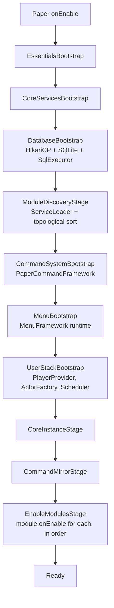

# Essentialist

> A modular essentials plugin for modern Paper servers.

<div align="center">

[](https://github.com/HanielCota/Essentialist/actions/workflows/ci.yml)
[](https://www.oracle.com/java/technologies/downloads/)
[](https://papermc.io/)
[](LICENSE)

[Features](#features) · [Commands](#commands) · [Installation](#installation) · [Configuration](#configuration) · [Architecture](#architecture) · [Development](#development) · [Releases](#releases)

</div>

---

## Overview

Essentialist provides the day-to-day commands a production Minecraft server expects — teleportation, homes, warps,
player utilities, staff tools, inventory management, virtual workstations, chat channels, and persistent data — in a
codebase that's structured as **small, independent modules** rather than a single feature blob.

Each module owns its own commands, configuration, listeners, menus, services, and persistence. The bootstrap
discovers modules through Java's `ServiceLoader`, sorts them by declared dependencies, and wires the shared
infrastructure (database, scheduler, menu framework, command framework) into each one. This keeps the plugin easier to
maintain, easier to extend, and safer to load on live servers.

## Features

| Area | Includes |
|:--|:--|
| Teleportation | Spawn, back history, direct teleport, teleport requests with favorites/blocks/contacts, homes, and warps. |
| Homes | Menu-driven create / teleport / rename / change icon / delete / pin / sort by name·most-used·recent, with per-home teleport counter and last-used timestamp. |
| TPA | Clickable accept/deny prompt, expiry timers, per-player privacy + DND + cross-world toggle, favorites with optional auto-accept, blocks, recent contacts, history menu, filterable player picker (all/favorites/same-world/recent). |
| Player tools | Fly, speed, gamemode, heal, feed, kill, night vision, hat, trash, ping, near, AFK tracking, vanish, nicknames, last-seen. |
| Inventory tools | Clear inventory, give, enchant, repair, compact, smelt, rename, invsee, ender chest access. |
| Staff tools | Kick, mute / unmute, whitelist management, clear chat, online count, player information, titles, action bar messages, social-spy. |
| Workstations | Virtual crafting table, anvil, grindstone, cartography table, smithing table, loom, and stonecutter. |
| Menus | Configurable GUI screens for homes, back history, TPA hub, vanish list, whitelist, info, blocked TPA list, favorites, pending TPA, target action, material picker, and more. |
| Chat | Local proximity chat, global broadcast (`/g`), staff channel (`/staffchat`), private messages (`/msg` + `/r`), per-channel cooldowns, repeated-message anti-spam, permission-gated colour/format, optional PlaceholderAPI integration. |
| Storage | SQLite-backed persistence for every feature with durable state; async writer keeps the main thread free; per-player caches with quit eviction. |
| Messages | MiniMessage everywhere — colors, gradients, hover text, clickable actions, decorations. |

## Requirements

| Requirement | Version |
|:--|:--|
| Server | Paper `1.21.11` or newer |
| Java | JDK / JRE `25` or newer |
| Database | SQLite, bundled locally (HikariCP pool) |

### Optional integrations

| Plugin | What it adds |
|:--|:--|
| [PlaceholderAPI](https://wiki.placeholderapi.com/) | Resolves PAPI placeholders in chat formats (e.g. `%vault_prefix%`) and provides the values for the `<prefix>` / `<suffix>` tags. Auto-detected; disable by blanking `placeholders.prefix-placeholder` / `placeholders.suffix-placeholder` in `chat.yml`. |

## Installation

1. Download the latest `Essentialist-<version>.jar` from the project releases.
2. Place the jar inside your server's `plugins/` directory.
3. Start or restart the server.
4. Edit the generated files in `plugins/Essentialist/` as needed (each module owns its own YAML).
5. Run `/essentials reload` after changing configuration files.

## Commands

Commands are permission-based. Commands that target another player generally require an additional `.others`
permission (e.g. `essentials.fly.others`).

### Teleportation

| Command | Description | Permission |
|:--|:--|:--|
| `/spawn` | Teleports to the server spawn. | `essentials.spawn.use` |
| `/setspawn` | Sets the server spawn at your current location. | `essentials.spawn.set` |
| `/back` | Opens or uses recent teleport history. | `essentials.back` |
| `/tp <player>` | Teleports to another player. | `essentials.tp` |
| `/tp <from> <to>` | Moves one player to another. | `essentials.tp.others` |
| `/tp <x> <y> <z>` | Teleports to coordinates. | `essentials.tp` |
| `/tphere <player>` | Brings another player to you. | `essentials.tphere` |
| `/tpcancel` | Cancels a warm-up teleport in progress. | `essentials.teleport.cancel` |
| `/tpa <player>` | Requests teleportation to a player. Opens the TPA hub when called without args. | `essentials.tpa` |
| `/tpahere <player>` | Requests that a player teleports to you. | `essentials.tpa` |
| `/tpaccept [player]` | Accepts a pending teleport request. | `essentials.tpa` |
| `/tpdeny [player]` | Denies a pending teleport request. | `essentials.tpa` |
| `/tpacancel` | Cancels your pending teleport request. | `essentials.tpa` |
| `/tpahistory [player]` | Opens recent teleport request history. | `essentials.tpa.history` |
| `/tpablock <player>` | Blocks TPA requests from a player. | `essentials.tpa` |
| `/tpaunblock <player>` | Removes a TPA block. | `essentials.tpa` |
| `/home [name]` | Teleports to a home; opens `/homes` if no name given. | `essentials.home.use` |
| `/homes` | Opens the homes menu (create, teleport, rename, change icon, pin, delete). | `essentials.home.list` |
| `/warp <name>` | Teleports to a warp. | `essentials.warp` |
| `/setwarp <name>` | Creates or replaces a warp. | `essentials.warp.set` |
| `/delwarp <name>` | Deletes a warp. | `essentials.warp.delete` |
| `/warps` | Lists available warps. | `essentials.warp.list` |

> **Homes are 100% menu-driven**: `/sethome` and `/delhome` no longer exist. Use the **+ Nova home** button in
> `/homes` to create one (chat prompt for the name; current location is captured at click time), and right-click any
> home in the menu to open per-home options (Teleport / Rename / Change icon / Pin / Delete).

### Player Utilities

| Command | Description | Permission |
|:--|:--|:--|
| `/fly [player]` | Toggles flight. | `essentials.fly` |
| `/fly on \| off [player]` | Enables / disables flight. | `essentials.fly` |
| `/speed walk \| fly <value> [player]` | Sets walking or flying speed. | `essentials.speed` |
| `/speed reset [player]` | Restores default speeds. | `essentials.speed` |
| `/gamemode <mode> [player]` | Changes gamemode. Alias: `/gm`. | `essentials.gamemode` |
| `/curar [player]` | Restores health. Alias: `/heal`. | `essentials.heal` |
| `/curar todos` | Heals every online player. | `essentials.heal.all` |
| `/alimentar [player]` | Restores hunger and saturation. Alias: `/feed`. | `essentials.feed` |
| `/alimentar todos` | Feeds every online player. | `essentials.feed.all` |
| `/matar [player]` | Kills a target player. Alias: `/kill`. | `essentials.kill` |
| `/luz [player]` | Toggles night vision. Alias: `/light`. | `essentials.light` |
| `/luz on \| off [player]` | Enables / disables night vision. | `essentials.light` |
| `/chapeu` | Equips the held item as a helmet. Alias: `/hat`. | `essentials.hat` |
| `/lixo` | Opens a temporary trash inventory. Alias: `/trash`. | `essentials.trash` |
| `/vanish [player]` | Toggles vanish for yourself or another player. | `essentials.vanish` |
| `/vanish list` | Opens the vanish list menu. | `essentials.vanish.see` |
| `/ping [player]` | Shows a player's ping. | `essentials.ping` |
| `/near [radius]` | Lists nearby players. | `essentials.near` |
| `/nick <name>` | Sets a nickname. | `essentials.nick` |
| `/nick off` | Clears your nickname. | `essentials.nick` |
| `/realname <nick>` | Resolves a nickname to a real player name. | `essentials.nick.realname` |
| `/seen <player>` | Shows when a player was last online. | `essentials.seen` |

### Items and Inventories

| Command | Description | Permission |
|:--|:--|:--|
| `/limpar [player]` | Clears an inventory after confirmation. Alias: `/clear`. | `essentials.clear` |
| `/give <item> [amount]` | Gives an item to yourself. | `essentials.give` |
| `/give para <player> <item> [amount]` | Gives an item to a player. | `essentials.give.others` |
| `/give all <item> [amount]` | Gives an item to all online players. | `essentials.give.all` |
| `/enchant <enchant> [level]` | Enchants the item in your hand. | `essentials.enchant` |
| `/enchant remove <enchant>` | Removes one enchantment. | `essentials.enchant` |
| `/enchant clear` | Removes all enchantments. | `essentials.enchant` |
| `/reparar [player]` | Repairs the item in hand. Alias: `/repair`. | `essentials.repair` |
| `/reparar tudo [player]` | Repairs inventory and armor items. | `essentials.repair` |
| `/compactar` | Converts ores and ingots into blocks. Alias: `/compact`. | `essentials.compact` |
| `/derreter` | Smelts ores in your inventory. Alias: `/smelt`. | `essentials.smelt` |
| `/rename [name]` | Renames the item in your hand. | `essentials.rename` |
| `/invsee <player>` | Opens another player's inventory, armor, and off-hand. | `essentials.invsee` |
| `/echest [player]` | Opens an ender chest. Alias: `/enderchest`. | `essentials.echest` |

### Workstations

| Command | Description | Permission |
|:--|:--|:--|
| `/bancada` | Opens a virtual crafting table. | `essentials.workbench` |
| `/bigorna` | Opens a virtual anvil. Alias: `/anvil`. | `essentials.anvil` |
| `/rebolo` | Opens a virtual grindstone. Alias: `/grindstone`. | `essentials.grindstone` |
| `/cartografia` | Opens a virtual cartography table. | `essentials.cartographytable` |
| `/forjamento` | Opens a virtual smithing table. | `essentials.smithingtable` |
| `/tear` | Opens a virtual loom. Alias: `/loom`. | `essentials.loom` |
| `/cortador` | Opens a virtual stonecutter. Alias: `/stonecutter` | `essentials.stonecutter` |

### Chat

Players type into the chat box for local proximity chat by default. Global broadcast, the staff channel, and private
messages are reached through explicit commands.

| Command | Description | Permission |
|:--|:--|:--|
| `/g <message>` | Sends a message to the global channel. Alias: `/global`. | `chat.global.use` |
| `/staffchat <message>` | Sends a one-shot staff message. Alias: `/sc`. | `chat.staff.use` |
| `/staffchat toggle` | Toggles persistent staff chat for your session. | `chat.staff.use` |
| `/msg <player> <message>` | Sends a private message. | `essentials.msg` |
| `/r <message>` | Replies to the last private message. Alias: `/reply`. | `essentials.msg` |
| `/socialspy [on \| off]` | Watches private messages as staff. | `essentials.socialspy` |
| `/mute <player> [duration] [reason]` | Mutes a player. | `essentials.mute` |
| `/unmute <player>` | Removes a mute. | `essentials.mute` |

Additional chat permissions:

| Permission | Grants |
|:--|:--|
| `chat.global.bypasscooldown` | Skip the `/g` cooldown. |
| `chat.local.bypassrange` | Local chat reaches every world. |
| `chat.local.bypasscooldown` | Skip the local-channel cooldown. |
| `chat.staff.receive` | See messages sent to the staff channel. |
| `chat.staff.bypasscooldown` | Skip the staff-channel cooldown. |
| `chat.bypassantispam` | Skip the repeated-message block. |
| `chat.color` | Use colour codes (`&c`, `<red>`, `<#aabbcc>`). |
| `chat.format` | Use decoration codes (`&l`, `<bold>`, `<italic>`). |
| `chat.admin` | Use the `/chat` admin command. |

`<click>`, `<hover>`, `<gradient>`, `<rainbow>`, and other dangerous MiniMessage tags are blocked in player input
regardless of permission. Admin format templates in `chat.yml` keep the full tag set.

### Staff and Server

| Command | Description | Permission |
|:--|:--|:--|
| `/essentials reload` | Reloads plugin configuration files. | `essentials.admin.reload` |
| `/actionbar <message>` | Sends an action bar message to yourself. | `essentials.actionbar` |
| `/actionbar broadcast <message>` | Sends an action bar message to everyone. | `essentials.actionbar.broadcast` |
| `/title [player] "title" ["subtitle"]` | Shows a title to a player. | `essentials.title` |
| `/title broadcast "title" ["subtitle"]` | Shows a title to everyone. | `essentials.title.broadcast` |
| `/clearchat` | Clears the public chat. | `essentials.clearchat` |
| `/chat reload` | Reloads every module's configuration. | `chat.reload` |
| `/whitelist` | Opens the whitelist menu. | `essentials.whitelist` |
| `/whitelist add <player>` | Adds a player to the whitelist. | `essentials.whitelist` |
| `/whitelist remove <player>` | Removes a player from the whitelist. | `essentials.whitelist` |
| `/kick <player> [reason]` | Kicks a player from the server. | `essentials.kick` |
| `/online` | Shows the current online player count. | `essentials.online` |
| `/informacoes [player]` | Opens a player information panel. Alias: `/info`. | `essentials.info` |

## Configuration

Configuration is split per feature. Each module owns one or more YAML files inside:

```text
plugins/Essentialist/
├── chat.yml
├── homes.yml
├── homes/material-names.yml
├── tpa.yml
├── warps.yml
├── ...
```

Splitting it keeps changes focused: homes, warps, messages, menus, cooldowns and limits can evolve without turning
plugin configuration into one giant file. New module fields fall back to their defaults when a user's existing YAML
doesn't have them (Configurate ignores extras and fills missing fields silently).

Messages support MiniMessage:

```text
<green>Done.</green>
<gradient:#00ff99:#00aaff>Welcome back.</gradient>
<hover:show_text:'Click to teleport'>[Warp]</hover>
```

## Architecture

Essentialist is built around three core ideas:

1. **The plugin is a thin shell.** `EssentialsPlugin#onEnable` just launches an `EssentialsBootstrap`, which runs a
   sequence of named stages. No business logic lives at the plugin level.
2. **Every feature is a module.** Modules are discovered via Java's `ServiceLoader`, sorted by declared dependencies,
   and given access to a single `ModuleEnvironment` that exposes the shared infrastructure (database executor, menu
   service, scheduler, player provider, command framework, etc.).
3. **Each module follows the same internal layout** (commands / services / repositories / menus / listeners / config
   / domain). The `ArchitecturePackageTest` enforces this at build time so structural drift can't slip in.

### Startup sequence



Every stage is a separate class under `bootstrap/`. If any stage fails the breadcrumb in the exception message points
at exactly which one — no half-enabled plugin state.

### Module layout

Each `modules/<name>/` package uses the same canonical sub-packages. Pick the right one when adding a class — the
`ArchitecturePackageTest` enforces a few of these rules at build time.

| Package | Purpose |
|:--|:--|
| `command/` | `@Command`-annotated handlers + their `*Notifier` / `*Dispatcher` / `*Orchestrator` / `*ResultHandler` / `*Presenter`. UI-facing glue lives here. |
| `service/` | Application services — orchestration logic, in-memory state, validators, resolvers. The only layer most other modules can import from. |
| `repository/` | Relational persistence (`*Repository` for CRUD, `*Table` for DDL/SQL constants, `*Cache` for in-memory mirrors). Does not import Bukkit beyond `Material` / `Location`. |
| `domain/` | Records and enums (`Home`, `Mute`, `TeleportRequest`). Cross-module imports are only allowed against `domain/`, `service/`, `history/`. |
| `menu/` | `EssentialsMenu` subclasses + their click handlers. Rendering helpers live under `menu/presentation/`. |
| `listener/` | Bukkit `Listener` implementations. Thin — they delegate to services. |
| `config/` | `*Config` records, `*Messages`, menu sections. Pure data carriers. |
| `history/` | Append-only persistence specific to histories (teleport requests, etc.). |
| `bootstrap/` | Wiring sub-classes when a module is large enough to need staged construction (e.g. `TpaRuntimeBootstrap`, `TpaMenuBootstrap`). |

### Naming conventions for orchestration

When a flow needs more than a `*Service`, the suffix picks the role:

| Suffix | Role |
|:--|:--|
| `*Dispatcher` | Routes one entry point onto one of several handlers (`TeleportDispatcher` picks tp-to-player vs tp-to-pos). |
| `*Orchestrator` | Sequences multiple steps (validate → service → notifier) for one logical operation. |
| `*Executor` | Runs one focused async / heavy step (`TeleportRequestExecutor` calls `teleportAsync`). |
| `*Resolver` | Input → canonical value mapping (`HomeNameResolver`, `RealNameResolver`). |
| `*Notifier` | Formats and sends user-facing messages. |

### Shared infrastructure

| Top-level package | What lives there |
|:--|:--|
| `bootstrap/` | Staged startup pipeline (`EssentialsBootstrap` + 8 stage classes). |
| `database/` | `async/` writer, `connection/` Hikari factory, `executor/` SQL executor, `schema/` dialect + `SqlTable`, `sqlite/` engine. |
| `module/` | `Module` API + `discovery/`, `environment/`, `lifecycle/`, `registration/`, `registry/` internals. |
| `command/` | Shared command annotations + the `EssentialsCommand` marker. |
| `config/` | Configurate-based config loader, `ConfigHandle` reload contract. |
| `menu/` | MenuFramework integration: `EssentialsMenu` interface, `MenuLayouts`, `MenuTemplates`, `PageNavigation`, `PaginatedInfoMenus`. |
| `paper/` | Paper-side abstractions: `PlayerProvider`, `ActorFactory`, etc. |
| `scheduler/` | Paper `Scheduler` wrapper + `MainThreadCallbacks` for completing futures on the owning thread. |
| `shared/` | Cross-cutting utilities: `ClickableMessage`, `ComponentUtils`, `Placeholders`, `Numbers`. |
| `api/` | Public `*Api` interfaces other modules / external code can implement (`HomesApi`, `WarpsApi`, etc.). |
| `user/` | Per-player session support (loading buckets on login, eviction on quit). |
| `service/` | Tiny service registry passed via `ModuleEnvironment`. |

### Persistence pattern

Every module that needs durable state follows the same three-layer recipe:

1. **`SqlTable`** owns the DDL + every SQL string for the table. `install()` is idempotent and runs any `ALTER ADD
   COLUMN` migrations on startup.
2. **`Sql*Repository`** implements the module's repository interface against the shared `SqlExecutor`. Reads return
   immutable domain records; writes are single-statement.
3. **`Cached*Repository`** wraps the SQL repo with an in-memory `*Cache` keyed by `UUID`. Loads on demand
   (typically via `AsyncPlayerPreLoginEvent`), writes through to the cache synchronously, and submits the SQL
   persist to the shared `AsyncDatabaseWriter` thread so the main thread never blocks on the database.

Quit events drop the player's bucket from memory; reconnects reload on demand. The async writer is registered as a
module closeable so it drains and shuts down cleanly on plugin disable.

### Menu pattern

Menus are built on the
[MenuFramework](https://github.com/HanielCota/MenuFramework) library:

- Layout (rows, content slots, navigation, info slot, action slots) is read from a `*MenuConfig` record so admins
  customise the menu via YAML without touching code.
- Static slots register at menu definition time. Per-viewer items (a player's own head, pinned counters, dynamic
  lore) render in a `dynamicContent` provider that runs every time the menu is opened or refreshed.
- Live updates use `MenuFeatures.refreshInterval(ticks)` — the TPA pending menu uses this to tick the countdown
  every second without flicker.
- `DROP`, `CONTROL_DROP`, `SWAP_OFFHAND`, `NUMBER_KEY` and `DOUBLE_CLICK` are hardcoded as dangerous click types by
  the framework. Secondary actions live behind explicit slots in sub-menus (e.g. the homes options sub-menu on
  right-click) instead of relying on hotkeys.

### Command pattern

Commands are declared with [CommandFramework](https://github.com/HanielCota/CommandFramework) annotations:

```java
@Command("home")
@EssentialsCommand
@Permission("essentials.home.use")
@Cooldown(duration = "2s")
@Description("Teleporta para a home indicada ou abre o menu /homes quando sem argumento.")
@Syntax("/home [nome]")
public record HomeCommand(...) {

  @DefaultSubcommand
  public CommandResult execute(@NonNull CommandActor actor, @Arg("nome") Optional<String> rawName) {
    // ...
  }
}
```

Command classes stay thin: they parse arguments, dispatch to services / orchestrators, and report results back via
`CommandActor.sendSuccess` / `sendError`. The framework handles permissions, cooldowns, async safety, and Brigadier
suggestions.

### Testing

| Tool | What it covers |
|:--|:--|
| **JUnit 5** | Unit tests for services, repositories, mappers, orchestrators (~160 tests today). |
| **ArchUnit** | `ArchitecturePackageTest` enforces module layout: cross-module imports only from `domain/`/`service/`/`history/`, persistence types stay in `repository/`, menu helpers live under `menu/presentation/`, bootstrap classes stay inside `bootstrap/`. |
| **CommandAliasUniquenessTest** | Guarantees no two commands share an alias across modules. |
| **Reflective fixtures** | Tests build `Home`, `Player`, `ClickContext` via `java.lang.reflect.Proxy` to keep unit tests free of MockBukkit. |

CI runs `./gradlew spotlessCheck build` on every push and PR; both block merge.

## Tech Stack

| Part | Technology |
|:--|:--|
| Language | Java 25 |
| Server API | Paper API for Minecraft `1.21.11+` |
| Build | Gradle with Kotlin DSL |
| Packaging | Shadow plugin (relocates Hikari + SQLite + MenuFramework + CommandFramework under `com.hanielcota.essentials.libs.*`) |
| Commands | [CommandFramework](https://github.com/HanielCota/CommandFramework) v3.3.1 |
| Menus | [MenuFramework](https://github.com/HanielCota/MenuFramework) v1.2.0 |
| Configuration | Configurate YAML 4.2 |
| Database | SQLite 3.53 + HikariCP 7.0 |
| Formatting | Spotless + google-java-format |
| Architecture tests | ArchUnit |
| Boilerplate | Lombok 1.18.46 (`@RequiredArgsConstructor`, `@NonNull`, `var` for locals) |

## Development

Build the plugin from source:

```bash
git clone https://github.com/HanielCota/Essentialist.git
cd Essentialist
./gradlew build
```

The compiled plugin is generated at:

```text
build/libs/Essentialist-<version>.jar
```

Useful development commands:

```bash
./gradlew test              # run the test suite
./gradlew spotlessApply     # format the codebase
./gradlew spotlessCheck     # verify formatting without modifying
./gradlew shadowJar         # build the relocated fat jar only
./gradlew build             # spotless + compile + tests + shadow jar
```

Conventions worth knowing before contributing:

- **Lombok 1.18.46** with `lombok.config` at the repo root. Prefer `@RequiredArgsConstructor`, `@NonNull` on
  parameters, `var` for locals. Don't write `Objects.requireNonNull` in internal code — `@NonNull` covers it.
- **Records over classes** for value carriers, command handlers, configs.
- **No comments unless the *why* is non-obvious.** Names carry intent; docstrings belong on cross-cutting types.
- **Vertical-flow code style** (one cognitive intention per line, named locals over inline chains, guard clauses
  first). The full rules live in [CLAUDE.md](CLAUDE.md).
- **Async teleport everywhere**: `player.teleportAsync(loc).thenAccept(...)` instead of `player.teleport(loc)`.
- **All chat messages go through MiniMessage** via `ComponentUtils.mini(...)`.

## Project Layout

```text
src/main/java/com/hanielcota/essentials/
├── EssentialsPlugin.java     plugin entry — just launches the bootstrap
├── api/                      public *Api interfaces (HomesApi, WarpsApi, …)
├── bootstrap/                staged startup pipeline (8 stages)
├── command/                  shared command annotations + EssentialsCommand marker
├── config/                   Configurate-based config loader + ConfigHandle reload contract
├── core/                     EssentialsCore + small core services
├── database/
│   ├── async/                AsyncDatabaseWriter — single-thread writer pool per module
│   ├── connection/           Hikari connection factory
│   ├── executor/             SqlExecutor + ResultMapper
│   ├── schema/               SqlDialect, SqlTable, dialect helpers
│   └── sqlite/               SQLite-specific engine + dialect
├── exception/                custom exceptions (ModuleLoadException, …)
├── menu/                     MenuFramework integration helpers
├── module/                   Module API + discovery/environment/lifecycle/registration/registry
├── modules/                  every player-facing or staff-facing feature lives here
│   ├── actionbar/  afk/      back/      broadcast/  chat/       clear/
│   ├── clearchat/  compact/  enchant/   enderchest/ essentials/ feed/
│   ├── fly/        gamemode/ give/      hat/        heal/       homes/
│   ├── info/       invsee/   kick/      kill/       light/      list/
│   ├── msg/        mute/     near/      nick/       online/     ping/
│   ├── rename/     repair/   seen/      silencer/   smelt/      socialspy/
│   ├── spawn/      speed/    teleport/  title/      tpa/        trash/
│   └── vanish/     warps/    whitelist/ workstations/
├── paper/                    Paper-side abstractions (PlayerProvider, ActorFactory)
├── scheduler/                Scheduler wrapper + MainThreadCallbacks
├── service/                  tiny service registry
├── shared/                   ClickableMessage, ComponentUtils, Placeholders, Numbers
└── user/                     per-player session loading + eviction
```

## Releases

Releases are published from version tags:

```bash
git tag v0.1.0
git push origin v0.1.0
```

When a tag starting with `v` is pushed, GitHub Actions builds the plugin, derives the plugin version from the tag,
creates a GitHub Release, generates release notes, and uploads the jar from `build/libs/`. For example, `v0.1.0`
builds `Essentialist-0.1.0.jar`.

## License

Essentialist is released under the [MIT License](LICENSE).

<div align="center">
  <sub>Maintained by <a href="https://github.com/HanielCota">HanielCota</a>.</sub>
</div>
