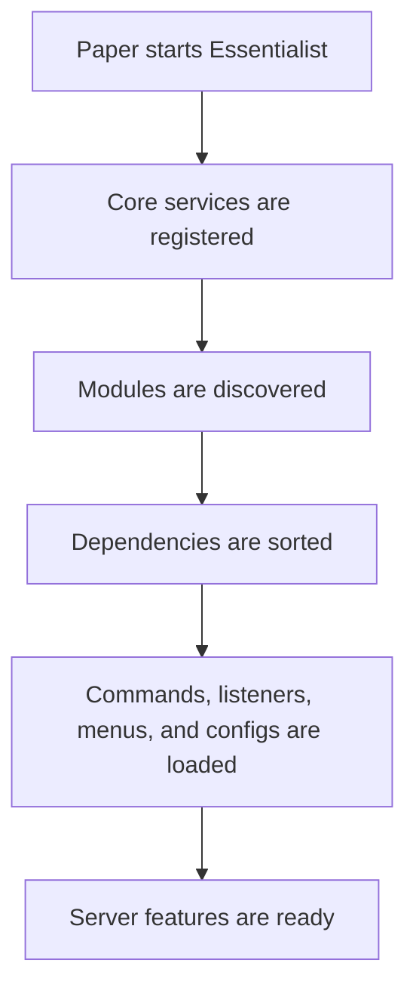

<p align="center">
  
</p>

<div align="center">

# Essentialist

**A clean, modular essentials plugin for modern Paper servers.**

[](https://github.com/HanielCota/Essentialist/actions/workflows/ci.yml)
[](https://www.oracle.com/java/technologies/downloads/)
[](https://papermc.io/)
[](LICENSE)

[Overview](#overview) · [Features](#features) · [Commands](#commands) · [Installation](#installation) · [Configuration](#configuration) · [Releases](#releases) · [Building](#building-from-source)

</div>

---

## Overview

Essentialist gives Paper servers the everyday tools players and staff expect: teleporting, homes, warps, flight,
healing, inventory utilities, moderation commands, chat tools, and more.

The plugin is built around small modules instead of one large block of code. Each feature loads on its own, keeps its
own configuration, and can be managed without forcing every other feature to depend on it. That keeps the project easier
to maintain and easier to understand.

In plain terms: Essentialist is meant to be the server utility plugin that stays organized as it grows.

## Features

| Area             | What it includes                                                                                                      |
|:-----------------|:----------------------------------------------------------------------------------------------------------------------|
| Teleportation    | Spawn, back, direct teleport, teleport requests, homes, and warps.                                                    |
| Player utilities | Fly, speed, gamemode, heal, feed, night vision, hat, trash, ping, and nearby players.                                 |
| Inventory tools  | Clear inventory, give items, enchant, repair, compact ores, smelt ores, rename items, invsee, and ender chest access. |
| Staff tools      | Kick, whitelist management, clear chat, online count, player info, titles, and action bar messages.                   |
| Menus            | GUI screens for homes, player information, and whitelist management.                                                  |
| Storage          | SQLite-backed data for features that need to remember player information.                                             |
| Messages         | MiniMessage support for modern colors, gradients, hover text, and clickable messages.                                 |

## Requirements

| Requirement     | Version                  |
|:----------------|:-------------------------|
| Server software | Paper `1.21.11` or newer |
| Java runtime    | Java `25` or newer       |
| Database        | SQLite, bundled locally  |

## Installation

1. Download the latest `Essentialist-<version>.jar`.
2. Place it inside your server's `plugins/` folder.
3. Start or restart the server.
4. Edit the generated files inside `plugins/Essentialist/` if you want to change messages, cooldowns, limits, or module
   behavior.
5. Use `/essentials reload` after changing configuration files.

## Commands

Most commands use permissions, cooldowns, and clear feedback messages. Commands that accept another player usually
require an extra `.others` permission, such as `essentials.fly.others`.

### Teleportation

| Command                      | What it does                                        | Permission               |
|:-----------------------------|:----------------------------------------------------|:-------------------------|
| `/spawn`                     | Sends you to the server spawn.                      | `essentials.spawn.use`   |
| `/setspawn`                  | Sets the server spawn at your current location.     | `essentials.spawn.set`   |
| `/back`                      | Returns to a previous location or teleport history. | `essentials.back`        |
| `/tp <player>`               | Teleports you to another player.                    | `essentials.tp`          |
| `/tp move <from> <to>`       | Moves one player to another player.                 | `essentials.tp.others`   |
| `/tp pos <x> <y> <z>`        | Teleports to coordinates.                           | `essentials.tp`          |
| `/tphere <player>`           | Brings another player to you.                       | `essentials.tphere`      |
| `/tpa <player>`              | Asks to teleport to a player.                       | `essentials.tpa`         |
| `/tpahere <player>`          | Asks a player to teleport to you.                   | `essentials.tpa`         |
| `/tpaccept [player]`         | Accepts a pending teleport request.                 | `essentials.tpa`         |
| `/tpdeny [player]`           | Denies a pending teleport request.                  | `essentials.tpa`         |
| `/tpacancel`                 | Cancels your pending teleport request.              | `essentials.tpa`         |
| `/tpahistory [player]`       | Opens recent teleport request history.              | `essentials.tpa.history` |
| `/home [name]`               | Teleports to one of your homes.                     | `essentials.home.use`    |
| `/sethome [name] [material]` | Saves a home with an optional icon.                 | `essentials.home.set`    |
| `/delhome [name]`            | Deletes one of your homes.                          | `essentials.home.delete` |
| `/homes`                     | Opens the homes menu.                               | `essentials.home.list`   |
| `/warp <name>`               | Teleports to a warp.                                | `essentials.warp`        |
| `/setwarp <name>`            | Creates or replaces a warp.                         | `essentials.warp.set`    |
| `/delwarp <name>`            | Deletes a warp.                                     | `essentials.warp.delete` |
| `/warps`                     | Lists available warps.                              | `essentials.warp.list`   |

### Gameplay

| Command                        | What it does                                            | Permission            |
|:-------------------------------|:--------------------------------------------------------|:----------------------|
| `/fly [player]`                | Toggles flight.                                         | `essentials.fly`      |
| `/fly on [player]`             | Enables flight.                                         | `essentials.fly`      |
| `/fly off [player]`            | Disables flight.                                        | `essentials.fly`      |
| `/speed walk <value> [player]` | Sets walking speed.                                     | `essentials.speed`    |
| `/speed fly <value> [player]`  | Sets flying speed.                                      | `essentials.speed`    |
| `/speed reset [player]`        | Restores default speeds.                                | `essentials.speed`    |
| `/gamemode <mode> [player]`    | Changes gamemode. Alias: `/gm`.                         | `essentials.gamemode` |
| `/curar [player]`              | Restores health. Alias: `/heal`.                        | `essentials.heal`     |
| `/curar todos`                 | Heals every online player.                              | `essentials.heal.all` |
| `/alimentar [player]`          | Restores hunger and saturation. Alias: `/feed`.         | `essentials.feed`     |
| `/alimentar todos`             | Feeds every online player.                              | `essentials.feed.all` |
| `/matar [player]`              | Kills the target player. Alias: `/kill`.                | `essentials.kill`     |
| `/luz [player]`                | Toggles night vision. Alias: `/light`.                  | `essentials.light`    |
| `/chapeu`                      | Wears the item in your hand as a helmet. Alias: `/hat`. | `essentials.hat`      |
| `/lixo`                        | Opens a temporary trash inventory. Alias: `/trash`.     | `essentials.trash`    |

### Items and Inventories

| Command                          | What it does                                              | Permission            |
|:---------------------------------|:----------------------------------------------------------|:----------------------|
| `/limpar [player]`               | Clears an inventory after confirmation. Alias: `/clear`.  | `essentials.clear`    |
| `/give <item> [amount] [player]` | Gives an item to a player.                                | `essentials.give`     |
| `/give all <item> [amount]`      | Gives an item to all online players.                      | `essentials.give.all` |
| `/enchant <enchant> [level]`     | Enchants the item in your hand.                           | `essentials.enchant`  |
| `/enchant remove <enchant>`      | Removes one enchantment.                                  | `essentials.enchant`  |
| `/enchant clear`                 | Removes all enchantments.                                 | `essentials.enchant`  |
| `/reparar [player]`              | Repairs the item in hand. Alias: `/repair`.               | `essentials.repair`   |
| `/reparar tudo [player]`         | Repairs inventory and armor items.                        | `essentials.repair`   |
| `/compactar`                     | Turns ores and ingots into blocks. Alias: `/compact`.     | `essentials.compact`  |
| `/derreter`                      | Smelts ores in your inventory. Alias: `/smelt`.           | `essentials.smelt`    |
| `/rename [name]`                 | Renames the item in your hand, or clears the custom name. | `essentials.rename`   |
| `/invsee <player>`               | Opens another player's inventory, armor, and off-hand.    | `essentials.invsee`   |
| `/echest [player]`               | Opens an ender chest. Alias: `/enderchest`.               | `essentials.echest`   |

### Server and Staff

| Command                                 | What it does                             | Permission                       |
|:----------------------------------------|:-----------------------------------------|:---------------------------------|
| `/essentials reload`                    | Reloads plugin configuration files.      | `essentials.admin.reload`        |
| `/actionbar <message>`                  | Sends an action bar message to yourself. | `essentials.actionbar`           |
| `/actionbar broadcast <message>`        | Sends an action bar message to everyone. | `essentials.actionbar.broadcast` |
| `/title [player] "title" ["subtitle"]`  | Shows a title to a player.               | `essentials.title`               |
| `/title broadcast "title" ["subtitle"]` | Shows a title to everyone.               | `essentials.title.broadcast`     |
| `/clearchat`                            | Clears the public chat.                  | `essentials.clearchat`           |
| `/whitelist`                            | Opens the whitelist menu.                | `essentials.whitelist`           |
| `/whitelist add <player>`               | Adds a player to the whitelist.          | `essentials.whitelist`           |
| `/whitelist remove <player>`            | Removes a player from the whitelist.     | `essentials.whitelist`           |
| `/kick <player> [reason]`               | Kicks a player from the server.          | `essentials.kick`                |
| `/ping [player]`                        | Shows a player's ping.                   | `essentials.ping`                |
| `/near [radius]`                        | Lists nearby players.                    | `essentials.near`                |
| `/online`                               | Shows current online player count.       | `essentials.online`              |
| `/informacoes [player]`                 | Opens a player information panel.        | `essentials.info`                |

## Configuration

Essentialist keeps configuration split by feature. Instead of one huge file, each module can create its own YAML file
inside:

```text
plugins/Essentialist/
```

That makes it easier to change one feature without digging through unrelated settings.

Example of the kind of settings a module may expose:

```yaml
repaired-hand: "<green>Item repaired successfully."
blacklist:
  - "minecraft:elytra"
repair-all-limit: 41
```

Messages support MiniMessage formatting, so server owners can use modern colors and effects:

```text
<green>Done.</green>
<gradient:#00ff99:#00aaff>Welcome back.</gradient>
<hover:show_text:'Click to teleport'>[Warp]</hover>
```

## How It Works

Essentialist is organized as a set of modules loaded through Java's `ServiceLoader`.



This structure gives the project a few practical benefits:

| Benefit                    | Why it matters                                                                   |
|:---------------------------|:---------------------------------------------------------------------------------|
| Smaller feature boundaries | A command like `/fly` does not need to live beside unrelated code like `/warps`. |
| Safer startup              | Modules declare dependencies, so required features can load in the right order.  |
| Cleaner configuration      | Each module can keep its own settings and messages.                              |
| Easier development         | New commands can be added without turning the project into one large file tree.  |

## Tech Stack

| Part          | Technology                         |
|:--------------|:-----------------------------------|
| Language      | Java 25                            |
| Server API    | Paper API for Minecraft `1.21.11+` |
| Build tool    | Gradle with Kotlin DSL             |
| Final jar     | Shadow plugin                      |
| Commands      | CommandFramework                   |
| Menus         | MenuFramework                      |
| Configuration | Configurate YAML                   |
| Database      | SQLite with HikariCP               |
| Formatting    | Spotless and google-java-format    |

## Building From Source

You need JDK `25` installed.

```bash
git clone https://github.com/HanielCota/Essentialist.git
cd Essentialist
./gradlew build
```

The compiled plugin will be created in:

```text
build/libs/Essentialist-<version>.jar
```

Useful development commands:

```bash
./gradlew test
./gradlew spotlessApply
./gradlew spotlessCheck
```

## Releases

Releases are published from version tags.

```bash
git tag v0.1.0
git push origin v0.1.0
```

When a tag starting with `v` is pushed, GitHub Actions builds the plugin, derives the plugin version from the tag,
creates a GitHub Release, generates release notes, and uploads the jar from `build/libs/`. For example, `v0.1.0` builds
`Essentialist-0.1.0.jar`.

GitHub Packages is not enabled by default because Essentialist is distributed as a server plugin jar. Packages are
useful later if the project exposes a separate API module that other plugins should consume through Maven.

## Project Layout

```text
src/main/java/com/hanielcota/essentials/
├── bootstrap/   startup and service wiring
├── command/     shared command helpers
├── config/      configuration loading
├── database/    SQLite and async database access
├── menu/        shared menu integration
├── module/      module lifecycle and dependency loading
├── modules/     player-facing and staff-facing features
├── scheduler/   Paper scheduler abstraction
├── service/     small service registry
└── user/        player session support
```

## License

Essentialist is released under the [MIT License](LICENSE).

<div align="center">
  <sub>Made by <a href="https://github.com/HanielCota">HanielCota</a>.</sub>
</div>
