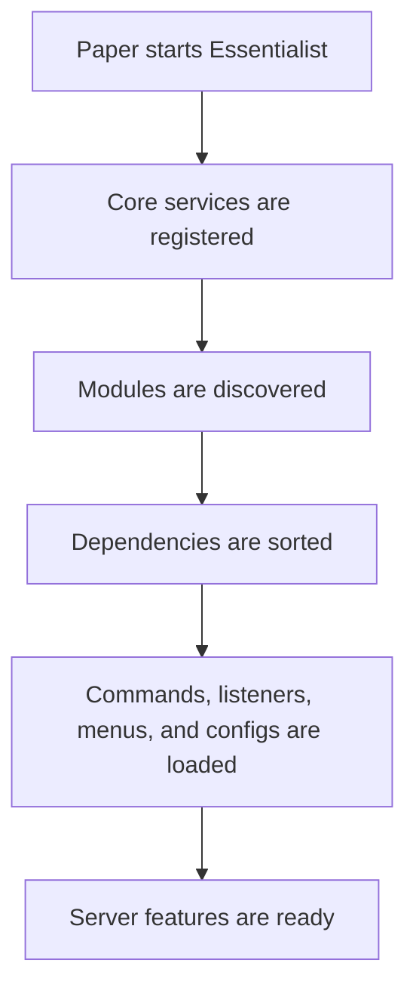

# Essentialist

> A modular essentials plugin for modern Paper servers.

<div align="center">

[](https://github.com/HanielCota/Essentialist/actions/workflows/ci.yml)
[](https://www.oracle.com/java/technologies/downloads/)
[](https://papermc.io/)
[](LICENSE)

[Features](#features) . [Commands](#commands) . [Installation](#installation) . [Configuration](#configuration) . [Development](#development) . [Releases](#releases)

</div>

---

## Overview

Essentialist provides the day-to-day commands expected from a production Minecraft server: teleportation, homes, warps,
player utilities, staff tools, inventory management, workstations, menus, and persistent data.

The project is built as a set of small modules instead of one large feature block. Each module owns its commands,
configuration, listeners, menus, and persistence needs. That keeps the plugin easier to maintain, easier to extend, and
safer to load on live servers.

## Features

| Area | Includes |
|:--|:--|
| Teleportation | Spawn, back history, direct teleport, teleport requests, homes, and warps. |
| Player tools | Fly, speed, gamemode, heal, feed, kill, night vision, hat, trash, ping, near, and vanish. |
| Inventory tools | Clear inventory, give, enchant, repair, compact, smelt, rename, invsee, and ender chest access. |
| Staff tools | Kick, whitelist management, clear chat, online count, player information, titles, and action bar messages. |
| Workstations | Virtual crafting table, anvil, grindstone, cartography table, smithing table, loom, and stonecutter. |
| Menus | GUI screens for homes, back history, player information, vanish list, and whitelist management. |
| Storage | SQLite-backed persistence for features that need durable player data. |
| Messages | MiniMessage support for colors, gradients, hover text, and clickable actions. |

## Requirements

| Requirement | Version |
|:--|:--|
| Server | Paper `1.21.11` or newer |
| Java | JDK/JRE `25` or newer |
| Database | SQLite, bundled locally |

## Installation

1. Download the latest `Essentialist-<version>.jar` from the project releases.
2. Place the jar inside your server's `plugins/` directory.
3. Start or restart the server.
4. Edit the generated files in `plugins/Essentialist/` as needed.
5. Run `/essentials reload` after changing configuration files.

## Commands

Commands are permission-based and support clear feedback messages. Commands that target another player generally use an
additional `.others` permission, such as `essentials.fly.others`.

### Teleportation

| Command | Description | Permission |
|:--|:--|:--|
| `/spawn` | Teleports to the server spawn. | `essentials.spawn.use` |
| `/setspawn` | Sets the server spawn at your current location. | `essentials.spawn.set` |
| `/back` | Opens or uses recent teleport history. | `essentials.back` |
| `/tp <player>` | Teleports to another player. | `essentials.tp` |
| `/tp move <from> <to>` | Moves one player to another player. | `essentials.tp.others` |
| `/tp pos <x> <y> <z>` | Teleports to coordinates. | `essentials.tp` |
| `/tphere <player>` | Brings another player to you. | `essentials.tphere` |
| `/tpcancel` | Cancels a warm-up teleport in progress. | `essentials.teleport.cancel` |
| `/tpa <player>` | Requests teleportation to a player. | `essentials.tpa` |
| `/tpahere <player>` | Requests that a player teleports to you. | `essentials.tpa` |
| `/tpaccept [player]` | Accepts a pending teleport request. | `essentials.tpa` |
| `/tpdeny [player]` | Denies a pending teleport request. | `essentials.tpa` |
| `/tpacancel` | Cancels your pending teleport request. | `essentials.tpa` |
| `/tpahistory [player]` | Opens recent teleport request history. | `essentials.tpa.history` |
| `/home [name]` | Teleports to one of your homes. | `essentials.home.use` |
| `/sethome [name] [material]` | Saves a home with an optional icon. | `essentials.home.set` |
| `/delhome [name]` | Deletes one of your homes. | `essentials.home.delete` |
| `/homes` | Opens the homes menu. | `essentials.home.list` |
| `/warp <name>` | Teleports to a warp. | `essentials.warp` |
| `/setwarp <name>` | Creates or replaces a warp. | `essentials.warp.set` |
| `/delwarp <name>` | Deletes a warp. | `essentials.warp.delete` |
| `/warps` | Lists available warps. | `essentials.warp.list` |

### Player Utilities

| Command | Description | Permission |
|:--|:--|:--|
| `/fly [player]` | Toggles flight. | `essentials.fly` |
| `/fly on [player]` | Enables flight. | `essentials.fly` |
| `/fly off [player]` | Disables flight. | `essentials.fly` |
| `/speed walk <value> [player]` | Sets walking speed. | `essentials.speed` |
| `/speed fly <value> [player]` | Sets flying speed. | `essentials.speed` |
| `/speed reset [player]` | Restores default speeds. | `essentials.speed` |
| `/gamemode <mode> [player]` | Changes gamemode. Alias: `/gm`. | `essentials.gamemode` |
| `/curar [player]` | Restores health. Alias: `/heal`. | `essentials.heal` |
| `/curar todos` | Heals every online player. | `essentials.heal.all` |
| `/alimentar [player]` | Restores hunger and saturation. Alias: `/feed`. | `essentials.feed` |
| `/alimentar todos` | Feeds every online player. | `essentials.feed.all` |
| `/matar [player]` | Kills a target player. Alias: `/kill`. | `essentials.kill` |
| `/luz [player]` | Toggles night vision. Alias: `/light`. | `essentials.light` |
| `/luz on [player]` | Enables night vision. | `essentials.light` |
| `/luz off [player]` | Disables night vision. | `essentials.light` |
| `/chapeu` | Equips the held item as a helmet. Alias: `/hat`. | `essentials.hat` |
| `/lixo` | Opens a temporary trash inventory. Alias: `/trash`. | `essentials.trash` |
| `/vanish [player]` | Toggles vanish for yourself or another player. | `essentials.vanish` |
| `/vanish list` | Opens the vanish list menu. | `essentials.vanish.see` |
| `/ping [player]` | Shows a player's ping. | `essentials.ping` |
| `/near [radius]` | Lists nearby players. | `essentials.near` |

### Items and Inventories

| Command | Description | Permission |
|:--|:--|:--|
| `/limpar [player]` | Clears an inventory after confirmation. Alias: `/clear`. | `essentials.clear` |
| `/give <item> [amount]` | Gives an item to yourself. | `essentials.give` |
| `/give para <player> <item> [amount]` | Gives an item to a player. | `essentials.give.others` |
| `/give all <item> [amount]` | Gives an item to all online players. | `essentials.give.all` |
| `/enchant <enchant> [level]` | Enchants the item in your hand. | `essentials.enchant` |
| `/enchant remove <enchant>` | Removes one enchantment. | `essentials.enchant` |
| `/enchant clear` | Removes all enchantments. | `essentials.enchant` |
| `/reparar [player]` | Repairs the item in hand. Alias: `/repair`. | `essentials.repair` |
| `/reparar tudo [player]` | Repairs inventory and armor items. | `essentials.repair` |
| `/compactar` | Converts ores and ingots into blocks. Alias: `/compact`. | `essentials.compact` |
| `/derreter` | Smelts ores in your inventory. Alias: `/smelt`. | `essentials.smelt` |
| `/rename [name]` | Renames the item in your hand or clears the custom name. | `essentials.rename` |
| `/invsee <player>` | Opens another player's inventory, armor, and off-hand. | `essentials.invsee` |
| `/echest [player]` | Opens an ender chest. Alias: `/enderchest`. | `essentials.echest` |

### Workstations

| Command | Description | Permission |
|:--|:--|:--|
| `/bancada` | Opens a virtual crafting table. | `essentials.workbench` |
| `/bigorna` | Opens a virtual anvil. Alias: `/anvil`. | `essentials.anvil` |
| `/rebolo` | Opens a virtual grindstone. Alias: `/grindstone`. | `essentials.grindstone` |
| `/cartografia` | Opens a virtual cartography table. | `essentials.cartographytable` |
| `/forjamento` | Opens a virtual smithing table. | `essentials.smithingtable` |
| `/tear` | Opens a virtual loom. Alias: `/loom`. | `essentials.loom` |
| `/cortador` | Opens a virtual stonecutter. Alias: `/stonecutter`. | `essentials.stonecutter` |

### Staff and Server

| Command | Description | Permission |
|:--|:--|:--|
| `/essentials reload` | Reloads plugin configuration files. | `essentials.admin.reload` |
| `/actionbar <message>` | Sends an action bar message to yourself. | `essentials.actionbar` |
| `/actionbar broadcast <message>` | Sends an action bar message to everyone. | `essentials.actionbar.broadcast` |
| `/title [player] "title" ["subtitle"]` | Shows a title to a player. | `essentials.title` |
| `/title broadcast "title" ["subtitle"]` | Shows a title to everyone. | `essentials.title.broadcast` |
| `/clearchat` | Clears the public chat. | `essentials.clearchat` |
| `/whitelist` | Opens the whitelist menu. | `essentials.whitelist` |
| `/whitelist add <player>` | Adds a player to the whitelist. | `essentials.whitelist` |
| `/whitelist remove <player>` | Removes a player from the whitelist. | `essentials.whitelist` |
| `/kick <player> [reason]` | Kicks a player from the server. | `essentials.kick` |
| `/online` | Shows the current online player count. | `essentials.online` |
| `/informacoes [player]` | Opens a player information panel. | `essentials.info` |

## Configuration

Essentialist keeps configuration split by feature. Each module can generate its own YAML file inside:

```text
plugins/Essentialist/
```

This keeps changes focused: homes, warps, messages, menus, cooldowns, and limits can evolve without turning the plugin
configuration into one large file.

Example configuration:

```yaml
repaired-hand: "<green>Item repaired successfully."
blacklist:
  - "minecraft:elytra"
repair-all-limit: 41
```

Messages support MiniMessage formatting:

```text
<green>Done.</green>
<gradient:#00ff99:#00aaff>Welcome back.</gradient>
<hover:show_text:'Click to teleport'>[Warp]</hover>
```

## Architecture

Essentialist discovers modules through Java's `ServiceLoader`, sorts dependencies, and then loads each feature through a
small lifecycle.



| Benefit | Why it matters |
|:--|:--|
| Clear boundaries | Commands such as `/fly`, `/warps`, and `/vanish` stay isolated in their own modules. |
| Safer startup | Modules can declare dependencies and load in the right order. |
| Focused configuration | Each feature can own the settings and messages it needs. |
| Easier extension | New commands can be added without reshaping unrelated features. |

## Tech Stack

| Part | Technology |
|:--|:--|
| Language | Java 25 |
| Server API | Paper API for Minecraft `1.21.11+` |
| Build | Gradle with Kotlin DSL |
| Packaging | Shadow plugin |
| Commands | CommandFramework |
| Menus | MenuFramework |
| Configuration | Configurate YAML |
| Database | SQLite with HikariCP |
| Formatting | Spotless and google-java-format |

## Development

Build the plugin from source:

```bash
git clone https://github.com/HanielCota/Essentialist.git
cd Essentialist
./gradlew build
```

The compiled plugin is generated at:

```text
build/libs/Essentialist-<version>.jar
```

Useful development commands:

```bash
./gradlew test
./gradlew spotlessApply
./gradlew spotlessCheck
```

## Project Layout

```text
src/main/java/com/hanielcota/essentials/
|-- bootstrap/   startup and service wiring
|-- command/     shared command helpers
|-- config/      configuration loading
|-- database/    SQLite and async database access
|-- menu/        shared menu integration
|-- module/      module lifecycle and dependency loading
|-- modules/     player-facing and staff-facing features
|-- scheduler/   Paper scheduler abstraction
|-- service/     small service registry
`-- user/        player session support
```

## Releases

Releases are published from version tags:

```bash
git tag v0.1.0
git push origin v0.1.0
```

When a tag starting with `v` is pushed, GitHub Actions builds the plugin, derives the plugin version from the tag,
creates a GitHub Release, generates release notes, and uploads the jar from `build/libs/`. For example, `v0.1.0` builds
`Essentialist-0.1.0.jar`.

## License

Essentialist is released under the [MIT License](LICENSE).

<div align="center">
  <sub>Maintained by <a href="https://github.com/HanielCota">HanielCota</a>.</sub>
</div>
