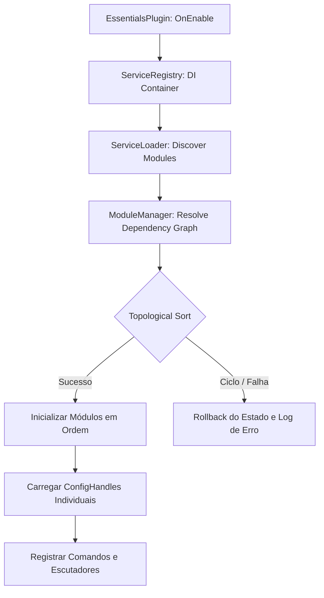

<p align="center">
  
</p>

<div align="center">

# ⚡ Essentialist

**Um plugin de essentials modular, moderno e altamente otimizado para servidores Paper.**

[](https://github.com/HanielCota/Essentialist/actions/workflows/ci.yml)
[](https://www.oracle.com/java/technologies/downloads/)
[](https://papermc.io/)
[](LICENSE)

---

**Essentialist** redefine o conceito de utilitários de servidor. Ao invés de uma arquitetura monolítica pesada, o
projeto é estruturado em **módulos independentes** carregados dinamicamente via `ServiceLoader`. Recursos não utilizados
não consomem memória ou processamento, e qualquer falha em um módulo ativa um sistema de rollback automático que protege
a estabilidade do servidor.

[Funcionalidades](#-funcionalidades) • [Requisitos](#-requisitos) • [Instalação](#-instalação) • [Comandos](#-comandos-e-módulos) • [Arquitetura](#-arquitetura-do-sistema) • [Configuração](#-configuração-dos-módulos) • [Compilação](#-compilando-o-projeto)

</div>

---

## ✨ Funcionalidades

* 🧩 **Arquitetura Modular**: Cada recurso é um `Module` isolado com ciclo de vida explícito (`BOOTING` ➔ `ENABLED` ➔
  `DISABLING`).
* 🧵 **Preparado para agendamento moderno**: Fluxos críticos usam schedulers compatíveis com Paper moderno, sem declarar
  suporte completo a Folia enquanto todos os módulos globais não forem isolados por região.
* 🔄 **Recarregamento Dinâmico (Hot-Reload)**: Modifique as configurações e aplique-as instantaneamente com
  `/essentials reload` sem reiniciar o servidor.
* 💾 **Persistência Robusta**: Histórico de teletransporte (`/back`) e sistemas complexos salvos localmente via **SQLite
  ** com pool de conexões **HikariCP**.
* 💬 **Formatação Rica (MiniMessage)**: Suporte completo a tags modernas do Kyori Adventure, gradientes, cores RGB e
  eventos de hover/click.
* 🖥️ **Menus Interativos (GUIs)**: Painéis visuais ricos para gerenciamento de Homes, informações de jogadores (
  `/informacoes`) e whitelist.
* 🛡️ **Proteção e Confirmação**: Cooldowns integrados por comando e necessidade de confirmação antes de executar ações
  destrutivas (ex: `/limpar`).

---

## 📋 Requisitos

| Requisito                       | Versão Suportada                                       |
|:--------------------------------|:-------------------------------------------------------|
| **Plataforma de Servidor**      | [Paper](https://papermc.io/) `1.21.11` ou mais recente |
| **Ambiente de Execução (Java)** | OpenJDK `25` ou superior                               |
| **Banco de Dados**              | SQLite (embarcado automaticamente)                     |

---

## 📦 Instalação

1. Baixe a versão mais recente do arquivo `Essentialist-<version>.jar`.
2. Insira o arquivo na pasta `plugins/` do seu servidor.
3. Inicie ou reinicie o servidor.
4. As pastas e arquivos de configuração individuais de cada módulo serão criados em `plugins/Essentialist/`.

---

## ⌨️ Comandos e Módulos

Os comandos do **Essentialist** são organizados por categorias para facilitar a navegação. Todos os comandos possuem
cooldowns configuráveis e suporte a targeting (aplicar o comando em si mesmo ou em terceiros via permissões `.others`).

### 🧭 Teletransporte & Localização

| Comando                | Aliases | Descrição                                                            | Permissão                |
|:-----------------------|:--------|:---------------------------------------------------------------------|:-------------------------|
| `/spawn`               | —       | Teleporta o jogador para o spawn do servidor (com atraso).           | `essentials.spawn.use`   |
| `/setspawn`            | —       | Define o ponto de spawn global na posição atual do jogador.          | `essentials.spawn.set`   |
| `/back`                | —       | Retorna à última localização registrada (morte ou teletransporte).   | `essentials.back`        |
| `/tp <jogador>`        | —       | Teleporta o remetente até outro jogador.                             | `essentials.tp`          |
| `/tp move <de> <para>` | —       | Teleporta um jogador até o outro.                                    | `essentials.tp.others`   |
| `/tp pos <x> <y> <z>`  | —       | Teleporta para coordenadas específicas no mundo.                     | `essentials.tp`          |
| `/tphere <jogador>`    | —       | Teleporta outro jogador até a sua posição atual.                     | `essentials.tphere`      |
| `/tpa <jogador>`       | —       | Envia um pedido de teletransporte até o jogador.                     | `essentials.tpa`         |
| `/tpahere <jogador>`   | —       | Solicita que o jogador se teleporte até você.                        | `essentials.tpa`         |
| `/tpaccept [jogador]`  | —       | Aceita um pedido de teletransporte pendente.                         | `essentials.tpa`         |
| `/tpdeny [jogador]`    | —       | Recusa um pedido de teletransporte pendente.                         | `essentials.tpa`         |
| `/tpacancel [jogador]` | —       | Cancela um pedido de teletransporte enviado.                         | `essentials.tpa`         |
| `/tpahistory`          | —       | Mostra o histórico recente de solicitações de teletransporte.        | `essentials.tpa`         |
| `/warp <nome>`         | —       | Teleporta para uma warp existente.                                   | `essentials.warp.use`    |
| `/setwarp <nome>`      | —       | Cria uma nova warp na localização atual.                             | `essentials.warp.create` |
| `/delwarp <nome>`      | —       | Remove uma warp existente.                                           | `essentials.warp.delete` |
| `/warps`               | —       | Abre uma lista interativa e clicável com todas as warps disponíveis. | `essentials.warp.list`   |

---

### 🕹️ Utilidades & Jogabilidade

| Comando                       | Aliases  | Descrição                                                                 | Permissão                |
|:------------------------------|:---------|:--------------------------------------------------------------------------|:-------------------------|
| `/fly [jogador]`              | —        | Ativa ou desativa o modo de voo do jogador.                               | `essentials.fly`         |
| `/speed walk <1-10> [player]` | —        | Define a velocidade de caminhada do jogador.                              | `essentials.speed`       |
| `/speed fly <1-10> [player]`  | —        | Define a velocidade de voo do jogador.                                    | `essentials.speed`       |
| `/speed reset [jogador]`      | —        | Restaura as velocidades padrão de caminhada e voo.                        | `essentials.speed`       |
| `/gamemode <modo> [jogador]`  | `/gm`    | Altera o modo de jogo (`survival`, `creative`, `adventure`, `spectator`). | `essentials.gamemode`    |
| `/curar [jogador]`            | `/heal`  | Restaura totalmente a vida e remove efeitos negativos.                    | `essentials.heal`        |
| `/curar todos`                | —        | Restaura a vida de todos os jogadores online.                             | `essentials.heal.all`    |
| `/alimentar [jogador]`        | `/feed`  | Restaura a fome e saturação do jogador.                                   | `essentials.feed`        |
| `/luz [jogador]`              | `/light` | Alterna a visão noturna (efeito permanente de light).                     | `essentials.light`       |
| `/chapeu`                     | `/hat`   | Equipa o item que está na mão principal do jogador como capacete.         | `essentials.hat`         |
| `/lixo`                       | `/trash` | Abre um inventário virtual temporário para descarte de itens.             | `essentials.trash`       |
| `/home [nome]`                | —        | Teleporta para uma de suas homes registradas.                             | `essentials.home.use`    |
| `/sethome [nome] [material]`  | —        | Define uma home na localização atual com um ícone customizado.            | `essentials.home.set`    |
| `/delhome [nome]`             | —        | Exclui uma home registrada.                                               | `essentials.home.delete` |
| `/homes`                      | —        | Abre uma GUI para gerenciar, teletransportar e customizar suas homes.     | `essentials.home.list`   |

---

### 📦 Gerenciamento de Itens & Inventário

| Comando                           | Aliases       | Descrição                                                             | Permissão             |
|:----------------------------------|:--------------|:----------------------------------------------------------------------|:----------------------|
| `/limpar [jogador]`               | `/clear`      | Limpa o inventário (solicita confirmação).                            | `essentials.clear`    |
| `/give <item> [quant] [jogador]`  | —             | Concede itens específicos a um jogador.                               | `essentials.give`     |
| `/give all <item> [quant]`        | —             | Concede um item específico para todos os jogadores online.            | `essentials.give.all` |
| `/enchant <encantamento> [level]` | —             | Encanta o item seguro na mão principal.                               | `essentials.enchant`  |
| `/enchant remove <encant>`        | —             | Remove um encantamento específico do item.                            | `essentials.enchant`  |
| `/enchant clear`                  | —             | Remove todos os encantamentos do item.                                | `essentials.enchant`  |
| `/reparar [jogador]`              | `/repair`     | Repara a durabilidade do item que está na mão.                        | `essentials.repair`   |
| `/reparar tudo [jogador]`         | `all`         | Repara todos os itens do inventário e armadura.                       | `essentials.repair`   |
| `/compactar`                      | `/compact`    | Compacta minérios e lingotes do inventário em blocos.                 | `essentials.compact`  |
| `/derreter`                       | `/smelt`      | Funde minérios brutos presentes no inventário.                        | `essentials.smelt`    |
| `/rename [nome]`                  | —             | Renomeia o item da mão principal (aceita MiniMessage).                | `essentials.rename`   |
| `/invsee <jogador>`               | —             | Abre e edita o inventário e armaduras de outro jogador em tempo real. | `essentials.invsee`   |
| `/echest [jogador]`               | `/enderchest` | Abre o baú do fim (Ender Chest) pessoal ou de outro jogador.          | `essentials.echest`   |

---

### 🛡️ Administração & Informação

| Comando                       | Aliases | Descrição                                                          | Permissão                        |
|:------------------------------|:--------|:-------------------------------------------------------------------|:---------------------------------|
| `/essentials reload`          | —       | Recarrega todos os arquivos de configuração sem reiniciar.         | `essentials.admin.reload`        |
| `/actionbar <msg>`            | —       | Envia uma mensagem de action bar para si mesmo.                    | `essentials.actionbar`           |
| `/actionbar broadcast <msg>`  | —       | Transmite uma action bar para todos os jogadores conectados.       | `essentials.actionbar.broadcast` |
| `/title [jogador] <msg>`      | —       | Exibe um título na tela de um jogador específico.                  | `essentials.title`               |
| `/title broadcast <msg>`      | —       | Transmite um título para todos os jogadores online.                | `essentials.title.broadcast`     |
| `/clearchat`                  | —       | Limpa o chat global para todos os jogadores.                       | `essentials.clearchat`           |
| `/whitelist`                  | —       | Abre a interface gráfica de gerenciamento da whitelist.            | `essentials.whitelist`           |
| `/whitelist add <jogador>`    | —       | Adiciona um jogador à whitelist do servidor.                       | `essentials.whitelist`           |
| `/whitelist remove <jogador>` | —       | Remove um jogador da whitelist do servidor.                        | `essentials.whitelist`           |
| `/kick <jogador> [motivo]`    | —       | Expulsa um jogador ativo do servidor.                              | `essentials.kick`                |
| `/ping [jogador]`             | —       | Exibe a latência de rede atual do jogador em milissegundos.        | `essentials.ping`                |
| `/near [raio]`                | —       | Detecta e lista jogadores próximos dentro de um raio configurável. | `essentials.near`                |
| `/online`                     | —       | Mostra a contagem de jogadores online e o limite do servidor.      | `essentials.online`              |
| `/informacoes [jogador]`      | —       | Abre um painel GUI detalhado com estatísticas do jogador.          | `essentials.info`                |

> [!NOTE]
> Para aplicar comandos a outros jogadores (targeting), conceda a permissão correspondente com o sufixo `.others` (ex:
`essentials.fly.others`, `essentials.feed.others`).

---

## 🏗️ Arquitetura do Sistema

O **Essentialist** foi desenvolvido com as melhores práticas de engenharia de software para a plataforma Bukkit/Paper.



### Detalhes Técnicos

* **Injeção de Dependências**: Sistema leve e customizado através de um `ServiceRegistry` integrado. Sem reflexão pesada
  em tempo de execução.
* **Ordem de Dependência (Topological Sort)**: O `ModuleManager` calcula as dependências declaradas entre os módulos em
  tempo de carregamento. Por exemplo, o módulo `/back` depende do módulo `teleport`. Se `teleport` falhar ou for
  desativado, `back` é desativado automaticamente, evitando erros em cascata.
* **Persistência**: Uma única pool de conexões robusta gerenciada pelo **HikariCP** conecta à base local SQLite,
  garantindo consultas rápidas e não-bloqueantes para operações como `/back` e `/homes`.

---

## ⚙️ Configuração dos Módulos

Cada funcionalidade cria seu próprio arquivo YAML dentro da pasta do plugin (`plugins/Essentialist/`). Isso evita
arquivos gigantes e facilita a manutenção.

Exemplo de configuração para o módulo `/reparar` (`repair.yml`):

```yaml
# repair.yml
repaired-hand: "<green>Item reparado com sucesso."
repaired-hand-other: "<green>Você reparou o item de <gold>{player}</gold>."
blacklist:
  - "minecraft:elytra"   # Itens que não podem ser reparados por este comando
repair-all-limit: 41     # Limite de itens processados por vez no '/reparar tudo'
```

> [!TIP]
> Use tags MiniMessage do Kyori Adventure para criar efeitos visuais avançados como
`<gradient:red:blue>Texto</gradient>` e `<hover:show_text:'Clique aqui!'>[Link]</hover>`.

---

## 🔨 Compilando o Projeto

Para compilar o código fonte e gerar o arquivo jar final, você precisa do **JDK 25** instalado em seu ambiente.

```bash
# 1. Clone o repositório
git clone https://github.com/HanielCota/Essentialist.git
cd Essentialist

# 2. Compile e gere o jar otimizado (Shadow Jar)
./gradlew build
```

O arquivo compilado com todas as dependências sombreadas e realocadas será salvo na pasta `build/libs/` com o nome
`Essentialist-<version>-all.jar`.

### Padronização de Código (Spotless)

O projeto utiliza o **Spotless** configurado com a formatação padrão da Google para Java. Garanta que seu código siga as
regras executando:

```bash
./gradlew spotlessApply   # Aplica a formatação automaticamente
./gradlew spotlessCheck   # Valida a conformidade da formatação
```

---

## 🧰 Stack Tecnológica

| Componente                | Tecnologia                                                         |
|:--------------------------|:-------------------------------------------------------------------|
| **Linguagem**             | Java 25                                                            |
| **Build & Tooling**       | Gradle (Kotlin DSL) + Shadow Plugin                                |
| **API Minecraft**         | Paper API (Minecraft 1.21.11+)                                     |
| **Framework de Comandos** | [CommandFramework](https://github.com/HanielCota/CommandFramework) |
| **Framework de Menus**    | [MenuFramework](https://github.com/HanielCota/MenuFramework)       |
| **Mapeamento de Config**  | Configurate (YAML)                                                 |
| **Banco de Dados**        | SQLite + HikariCP                                                  |
| **Linters & Formatters**  | Spotless / google-java-format                                      |

---

## 📄 Licença

Este projeto está licenciado sob a licença **MIT**. Consulte o arquivo [`LICENSE`](LICENSE) para obter mais detalhes.

---

<div align="center">
  <sub>Desenvolvido com 💖 por <a href="https://github.com/HanielCota">HanielCota</a></sub>
</div>
